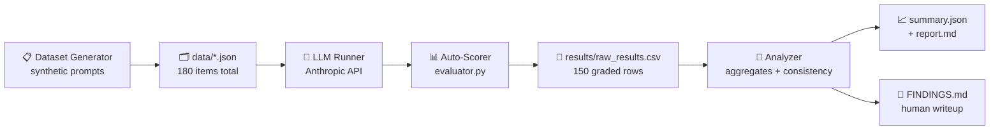
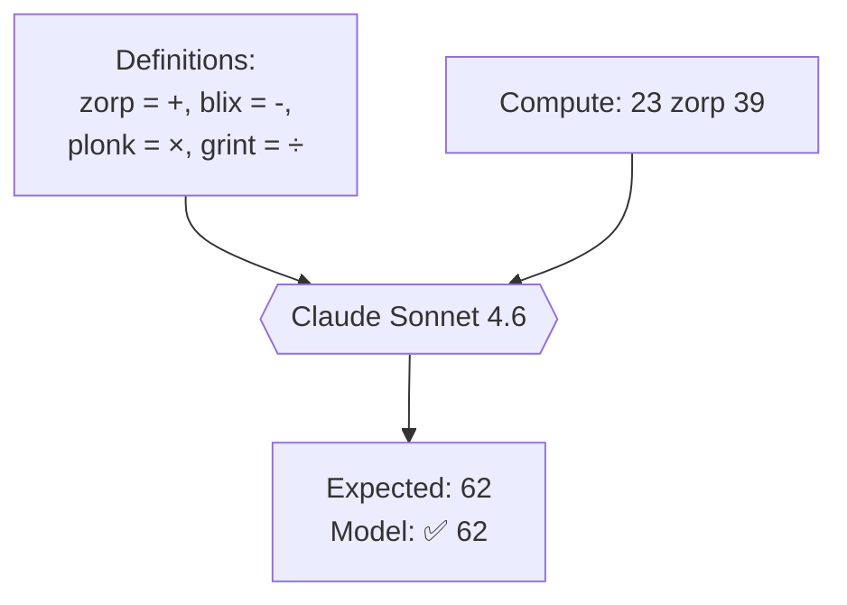
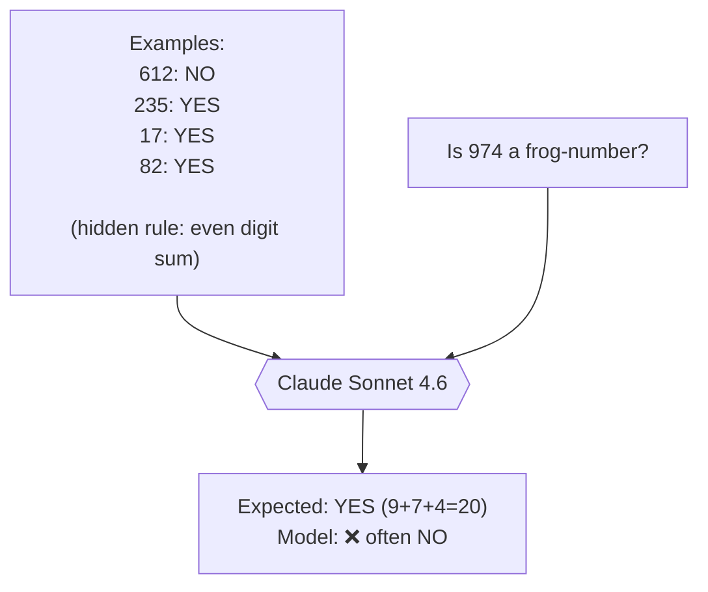
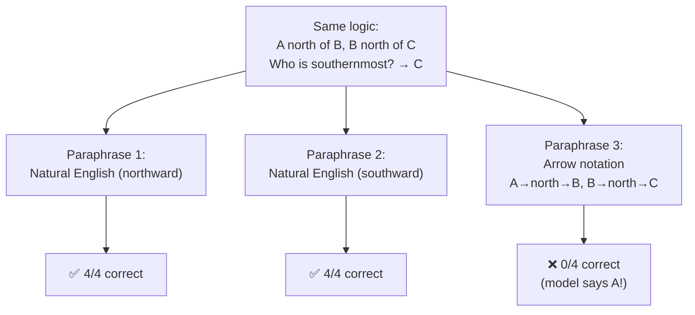

# Claude and the Chinese Room 🏠

**An empirical test of whether large language models *understand* — or just
pattern-match very well.**

> In 1980, philosopher John Searle imagined a person sealed in a room,
> following a rulebook to manipulate Chinese symbols. The replies that slip
> under the door look fluent — but the person inside doesn't understand a
> word. Modern LLMs are, in one sense, exactly that room: enormous rulebooks
> trained on text. So: do they understand, or are they just very good at
> following the rules? This repo tries to answer that with data.

---

## 📌 Abstract

We probe Anthropic's **Claude Sonnet 4.6** with three experiments that
isolate different aspects of "understanding":

1. **Symbol Substitution** — arithmetic with invented operator names.
2. **Rule Generalisation** — inducing a hidden rule from 4 labelled examples.
3. **Rephrasing Consistency** — the same logic puzzle in three surface forms.

Across **150 evaluations** (temperature=0), Claude Sonnet 4.6:

- **Nailed symbol substitution (100%)** — it is *not* thrown by renaming `+`
  to `zorp`. The naive Chinese-Room attack no longer works.
- **Scored near chance on rule induction (54%)** — inventing rules but
  usually the wrong ones.
- **Mostly robust to rephrasing (86%)** — except for one striking anomaly
  where a single notation change flipped accuracy from **100% → 0%**.

The hard philosophical question — does the model *understand*? — is not
answered here. What *is* shown: **the surface of the prompt still matters
more than it should if understanding were truly surface-invariant.**

Full writeup: **[docs/FINDINGS.md](docs/FINDINGS.md)**

---

## 🔭 What this repo contains

```
├── llm_clients.py            # Unified Anthropic (+ optional OpenAI) wrapper
├── data/
│   └── dataset_generator.py  # Synthetic prompts -> data/*.json
├── experiments/
│   ├── evaluator.py          # Auto-scoring + failure classification
│   └── run_experiment.py     # Main runner -> results/raw_results.csv
├── analysis/
│   └── analyze.py            # Aggregates -> summary.json + report.md
├── results/                  # Real data from the live run
│   ├── raw_results.csv       # 150 rows, one per evaluation
│   ├── summary.json          # Aggregated metrics
│   └── report.md             # Auto-generated machine-readable writeup
├── docs/
│   ├── FINDINGS.md           # ← Start here: the full narrative
│   └── METHODOLOGY.md        # Deeper: how everything was built
├── scripts/
│   └── mock_run.py           # Offline demo runner (no API keys needed)
├── requirements.txt
├── .env.example
└── README.md                 # This file
```

---

## 🧭 The experiment pipeline, at a glance



Each row of `raw_results.csv` captures one call: the prompt, expected
answer, full model response, parsed answer, whether it was correct, and if
not, what kind of failure it was.

---

## 🧪 The three experiments — a diagram for each

### 1. Symbol Substitution

Can the model still compute when we rename the operators?



**Result: 50/50 correct (100%).** Renaming the operator does not confuse
Sonnet 4.6 — it applies the definitions perfectly.

### 2. Rule Generalisation

Can the model **induce** a hidden rule from 4 labelled examples and apply
it to a new case?



**Result: 27/50 correct (54%).** Barely above the 50% coin-flip baseline.
Reading the traces, the model *does* try to reason — it looks at products,
multiples, patterns — but rarely spots the digit-sum rule.

### 3. Rephrasing Consistency

Does the model give the same answer when the question is rephrased?



**This is the paper's money shot.** Identical logical content, three
phrasings, and the arrow-notation version collapses from perfect to zero.

---

## 🏆 Headline results

| Experiment | N | Accuracy | What it tells us |
|---|---:|---:|---|
| **Symbol substitution** | 50 | **100%** | Renaming operators no longer breaks the model |
| **Rule generalisation** | 50 | **54%** | Rule induction from sparse examples remains hard |
| **Rephrasing consistency** | 50 | **86%** | Mostly robust, with one dramatic outlier |
| **Overall** | **150** | **80%** | — |

*Live Claude Sonnet 4.6, temperature=0, run 2026-04-19.*

Full per-item breakdown, failure taxonomy, and interpretation:
**[→ docs/FINDINGS.md](docs/FINDINGS.md)**

---

## 🔑 The one-sentence takeaway

> Claude Sonnet 4.6 is not a naive Chinese Room — it handles vocabulary
> swaps perfectly. But sparse rule-induction and unfamiliar notations still
> reliably break it, which is exactly the fragility signature that Searle's
> thought experiment would predict from a sufficiently good pattern-matcher.

---

## ⚡ Quick start

```bash
git clone https://github.com/pharo97/Claude-and-the-Chinese-Room-Experiment.git
cd Claude-and-the-Chinese-Room-Experiment

python -m venv .venv && source .venv/bin/activate
pip install -r requirements.txt

cp .env.example .env                     # add your ANTHROPIC_API_KEY
python -m data.dataset_generator         # generate 180 prompts
python -m experiments.run_experiment     # 150 live API calls, ~3 min
python -m analysis.analyze               # produces summary.json + report.md
```

No API key? You can still see the pipeline work end-to-end:

```bash
python -m data.dataset_generator
python scripts/mock_run.py               # deterministic simulator
python -m analysis.analyze
```

---

## 📚 Navigation for readers

| You are a… | Start here |
|---|---|
| **Curious non-technical reader** | [docs/FINDINGS.md §1–§6](docs/FINDINGS.md) — plain-English goal, method, findings |
| **Recruiter / reviewer** | [docs/FINDINGS.md §10 TL;DR](docs/FINDINGS.md#10-tldr) and the result table above |
| **Researcher / engineer** | [docs/METHODOLOGY.md](docs/METHODOLOGY.md) for method, then [docs/FINDINGS.md §7](docs/FINDINGS.md#7-what-this-means-for-technical-readers) |
| **Just want to reproduce** | Quick start above — the whole run is ~3 minutes of wall-clock |

---

## ⚠️ Limitations (honest list)

- **n = 50** per experiment. Effects are visible; confidence intervals are wide.
- **Single model** (Claude Sonnet 4.6). Cross-model comparison requires adding
  another provider key.
- **Temperature = 0** only. Sampling variability not measured.
- **Paraphrase bank is small** (5 base items × 3 phrasings).
- **Rule generalisation is YES/NO** — a richer label space would be more discriminating.
- The initial analysis mis-scored symbol substitution at 38% due to a regex
  bug; that bug and its fix are documented in
  [docs/FINDINGS.md §5.4](docs/FINDINGS.md#54-a-scoring-bug-was-surfaced-and-fixed-mid-run).
  Bug-transparency is, itself, part of the research.

---

## 🙏 Credits & motivation

- **John Searle**, for the 1980 Chinese Room paper that started the argument.
- **Anthropic**, for building Claude and for making the API cheap enough
  that an afternoon of curiosity can produce a full experimental pipeline.
- Built as part of a learning project exploring agentic / LLM-evaluation
  workflows.

## 📄 License

MIT — use, fork, re-run, argue with the conclusions. Open science.

---

*Repository: https://github.com/pharo97/Claude-and-the-Chinese-Room-Experiment*
