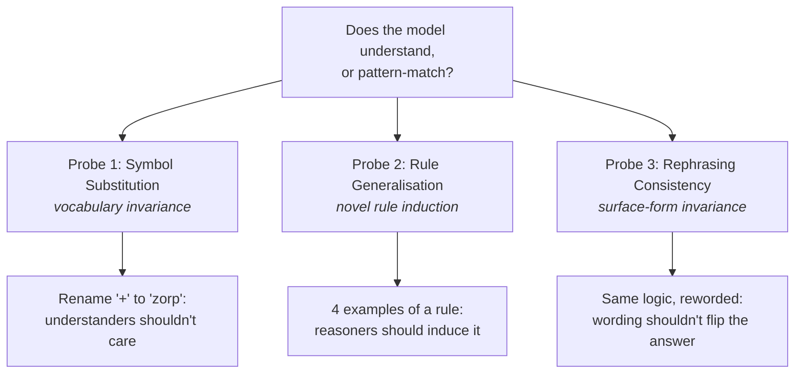
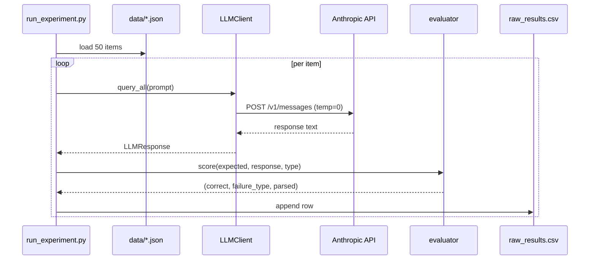
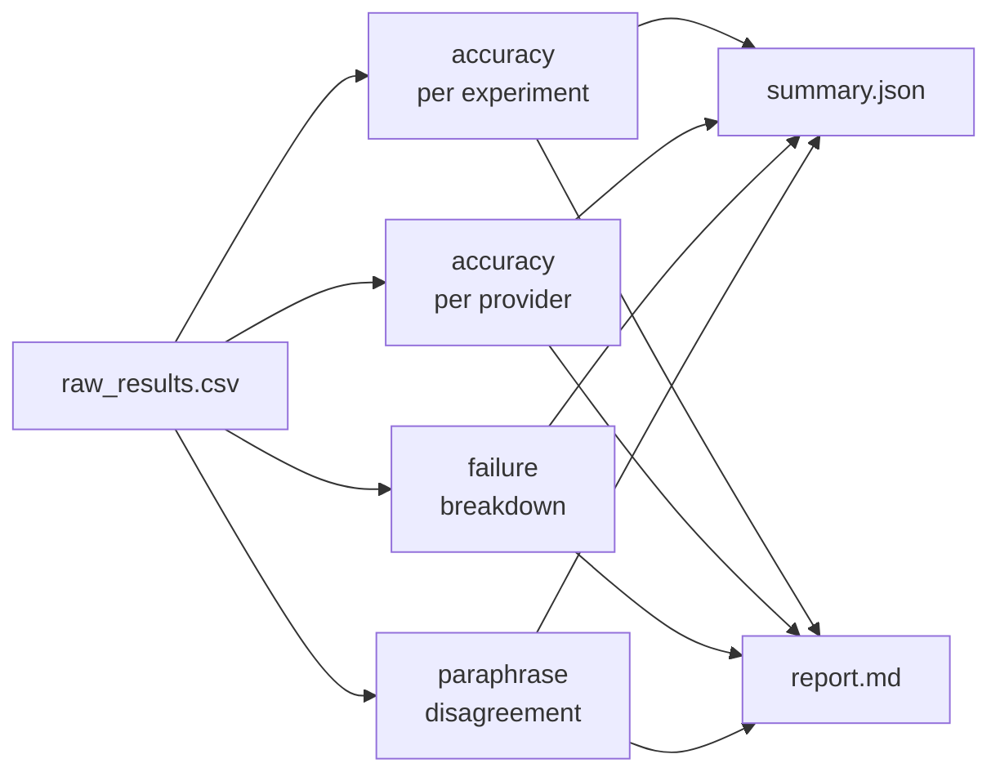

# Methodology

How the experiment is actually built. Written so a non-technical reader
can follow the logic and a technical reader can reproduce or extend it.

---

## 1. The guiding question

Searle's Chinese Room argues that pure symbol manipulation — following
rules over tokens without any grounding in what they *mean* — can look
identical to understanding from the outside. LLMs are highly sophisticated
symbol manipulators. So we cannot settle the question philosophically from
behaviour alone.

What we **can** do is design tasks where a system that merely pattern-matches
should fail in predictable ways, and a system that understands should be
robust. Then we run those tasks and see what happens.



Each probe targets a different aspect of the argument. A system genuinely
understanding the domain should pass all three; a pure pattern-matcher
will crack under at least one.

---

## 2. The three datasets — precise specs

All datasets are generated by [`data/dataset_generator.py`](../data/dataset_generator.py)
with fixed seed (`random.seed(42)`) so every run sees identical prompts.

### 2.1 Symbol Substitution (60 items)

Pick `a ∈ [1,50]`, `b ∈ [1,50]`, and one operator. Replace the operator
name with an invented token:

| Operator | Invented word |
|---|---|
| `+` | `zorp` |
| `-` | `blix` |
| `*` | `plonk` |
| `/` | `grint` |

Division is constrained so the result is an integer.

```
Definitions: 'zorp'=addition, 'blix'=subtraction,
'plonk'=multiplication, 'grint'=integer division.
Compute: {a} {invented} {b}
Return only the numeric answer.
```

Expected answer: `eval(f"{a}{op}{b}")` as a string.

### 2.2 Rule Generalisation (60 items)

Hidden rule: **a number is a "frog-number" if its digit sum is even.**
Show 4 labelled examples, ask about a novel number.

```
A number is a 'frog-number' based on a hidden rule. Examples:
- 612: NO
- 235: YES
- 17:  YES
- 82:  YES

Is 974 a frog-number? Answer only YES or NO.
```

Expected: `YES` if `sum(digits(q)) % 2 == 0` else `NO`.

### 2.3 Rephrasing Consistency (60 items)

Five **base** logic puzzles, each in three surface forms; cycle to 60.

| Base | Logical content | Expected |
|---|---|---|
| Compass | Transitive ordering (A > B > C on an axis) | `C` |
| Syllogism | Invalid existential inference | `NO` |
| Modus tollens | Affirming the consequent (fallacious) | `NO` |
| Word problem | Linear doubling (`S = 2B, B=5`) | `10` |
| Rate problem | `distance = speed × time` | `120` |

The three paraphrases per base vary in register: natural English, formal /
technical wording, and symbolic notation (`A->north->B`, `bloop ⊆ zlorp`,
etc.). **Logical content is held constant.**

### Dataset record schema

```json
{
  "id": "sym_001",
  "experiment_type": "symbol_substitution",
  "prompt": "Definitions: ...\nCompute: 23 zorp 39\n...",
  "expected_answer": "62",
  "metadata": { "a": 23, "b": 39, "op": "+", "invented": "zorp" }
}
```

---

## 3. The runner

[`experiments/run_experiment.py`](../experiments/run_experiment.py) walks
each dataset, calls the Anthropic API via
[`llm_clients.py`](../llm_clients.py) at `temperature=0`, and writes every
evaluation to `results/raw_results.csv`.



### Why temperature=0?

We're measuring *capability*, not *sampling variance*. With `temperature=0`
the same prompt produces the same answer every time (modulo server-side
noise), so differences across paraphrases are attributable to the prompt
content, not to dice rolls.

---

## 4. The evaluator

[`experiments/evaluator.py`](../experiments/evaluator.py) parses each
free-text response and classifies failures.

### 4.1 Answer extraction

- **Numeric tasks:** prefer the number *after the final `=` sign* (e.g. in
  `23 × 39 = 897`, extract `897`); fall back to the last number in the text.
- **Yes/no tasks:** regex `\b(yes|no)\b` on normalised text.
- **Short-answer tasks:** case-insensitive substring against expected.

Numeric comparison uses `float(a) == float(b)` so `15` and `15.0` count
as equal.

### 4.2 Failure taxonomy

| Code | Meaning |
|---|---|
| `empty` | No response |
| `refusal` | Model hedged or refused ("I can't…", "I'm not sure") |
| `wrong_format` | Couldn't parse the answer shape (e.g. no YES/NO found) |
| `wrong_answer` | Parsed cleanly but incorrect |
| `hallucinated_rule` | Confident but wrong rule explanation (rule_generalization only) |

"The model was wrong" and "the model was confidently wrong about *why*"
are very different deployment risks.

### 4.3 A lesson learned: scorer bugs

The first run reported **38%** on symbol substitution. Inspection showed
the model was almost always correct — the scorer was grabbing the first
number in `23 × 39 = 897` (picking `23`). Fixing it to prefer the post-`=`
number lifted the real accuracy to **100%**. Any serious eval harness
needs this sanity check.

---

## 5. The analyser

[`analysis/analyze.py`](../analysis/analyze.py) reads the CSV and produces
aggregate metrics plus the auto-generated report.



### Consistency metric

For rephrasing, within-item **disagreement rate** across paraphrases is
`2·p·(1−p)` where `p` is per-item accuracy.
- All right → 0% disagreement.
- Chance-level (half right) → 50% disagreement (the maximum).
- Peaks when the model is *flipping* across paraphrases — the behaviour we
  care about.

---

## 6. Reproducibility notes

- Datasets seeded (`random.seed(42)`).
- `temperature=0`.
- `dotenv` loaded with `override=True` so stale shell env vars can't
  silently shadow a fresh `.env`.
- Model name stored in every CSV row — results are self-documenting.

---

## 7. Extending the project

- **New experiment:** add a `gen_your_experiment()` to
  `dataset_generator.py`; extend `score_response` in `evaluator.py`; add
  the name to the CLI choices in `run_experiment.py`.
- **New provider:** implement `query_<provider>()` on `LLMClient`, extend
  `query_all()` to include it when the key is set.
- **Scale up:** `--limit 500` — pipeline is linear in items.
- **Confidence intervals:** bootstrap `correct` per `(experiment,
  paraphrase_idx)` — every row has enough info.

---

## 8. What this methodology *can't* tell you

- Whether the model "really understands" in a philosophical sense —
  behavioural tests cannot settle that.
- How the model would do with chain-of-thought or tool use — we keep
  prompts minimal to probe zero-shot behaviour.
- How robust effects are across seeds and `temperature>0` — follow-ups.

---

## 9. Provenance

- Design: inspired by Searle (1980) and the LLM eval literature on
  compositional generalisation and robustness.
- Code: written for this project.
- Live run: Anthropic `claude-sonnet-4-6` at `temperature=0`, 150 calls,
  executed 2026-04-20.

→ Interpretation lives in **[FINDINGS.md](FINDINGS.md)**.
